```{r setup, include=FALSE}
knitr::opts_chunk$set(echo = TRUE, results = 'hide', warning = FALSE, message = FALSE)
```

# 第２回（４月２０日）：RStudioでデータの操作と計算

## 準備

### Rコードと関連ファイルを保存するための新しいフォルダを作成します。

例えば、`Document`フォルダ内に`R`という名前のフォルダを作成します。


### RStudioを起動し、作業ディレクトリ（パス、path）をRに設定しま。

#### 方法は3通りあります。{-}

#### 1. `setwd()`関数を使う
  
1. `R`フォルダに移動します。


2. パスを選択し、コピーします。


3. RStudioを開き、コード:`setwd("C:\\Users\\xxx\\Documents\\R")`　ありますいは　`setwd("C:/Users/xxx/Documents/R")`
を入力します

注意：パスを `" "` で囲み、 `\` を `\\` または `/` に書き換えてください。
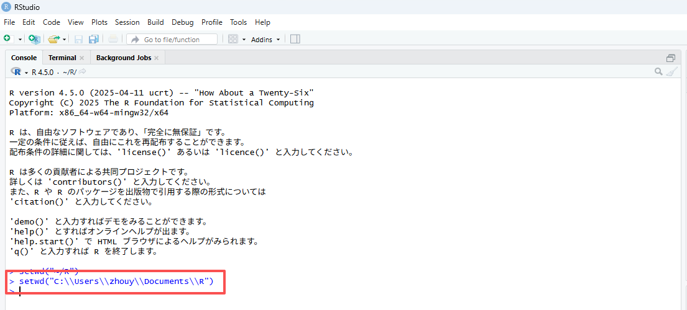


#### 2. Session をクリックします。

1. RStudioの一番上へ移動し、「`Session`」-->「`Set Working Directory`」-->「`Choose Directory`」をクリックします。
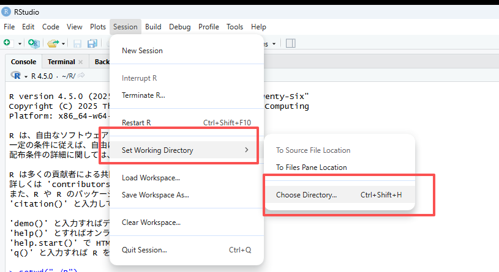

2.Rフォルダを選択し、「`Open`」をクリックします。
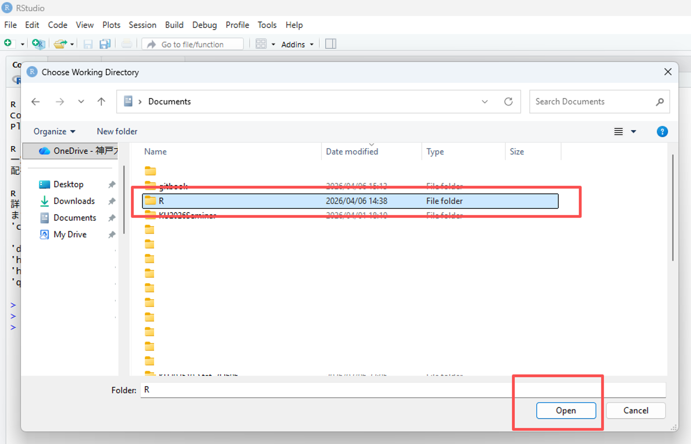


#### 3. 右下のパネルから設定します。

1. RStudioの右下のパネルへ移動します。「`Home`」をクリックし、`R`フォルダを選択します。

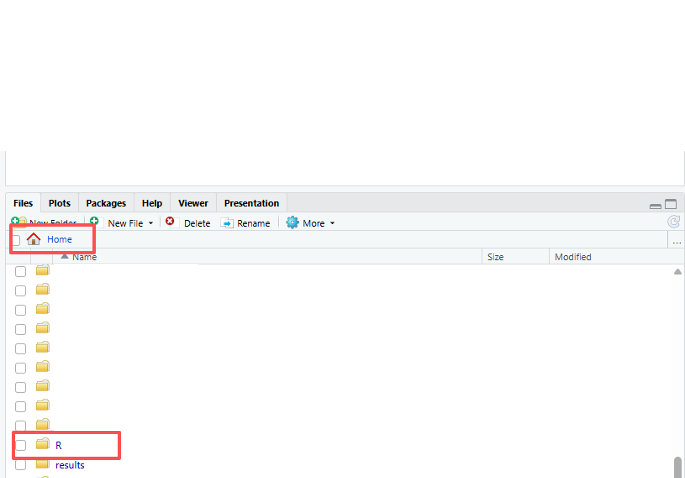

2.「`Set Working Directory`」をクリックします。


### 設定の確認

「`Go to Working Directory`」をクリックし、`Files`タブ内に`R`フォルダにいくことを確認してください。

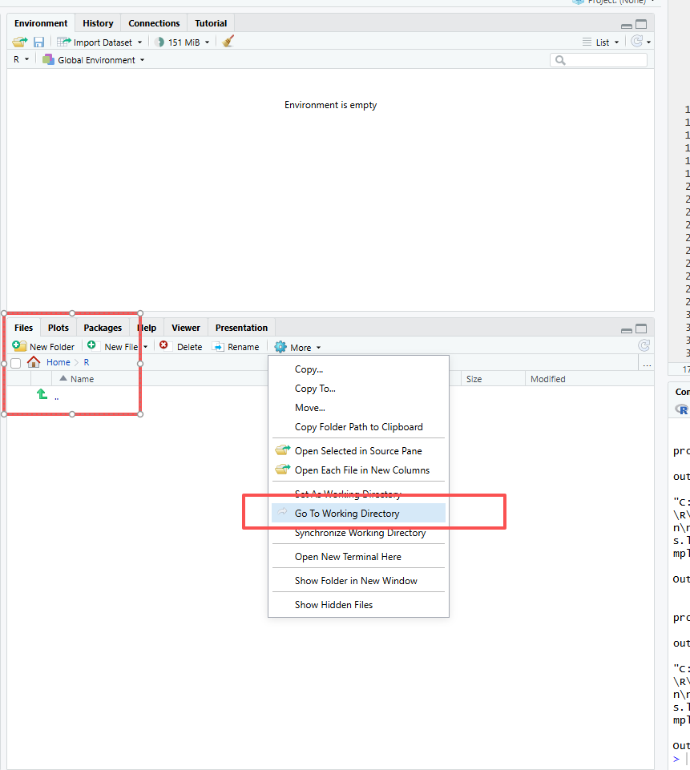

## スクリプトの作成

1. `File` --> `New File` --> `R Script` をクリックします。`Untitled1`というファイルが作成されます。


2. ありますいは、`File` の下のボタンをクリックし、`R Script` をクリックします。`Untitled1`というファイルが作成されます。


### スクリプトの保存

フロッピーディスクのアイコンをクリックします。ファイル名を「code1」と入力し、「`Save`」ボタンをクリックします。
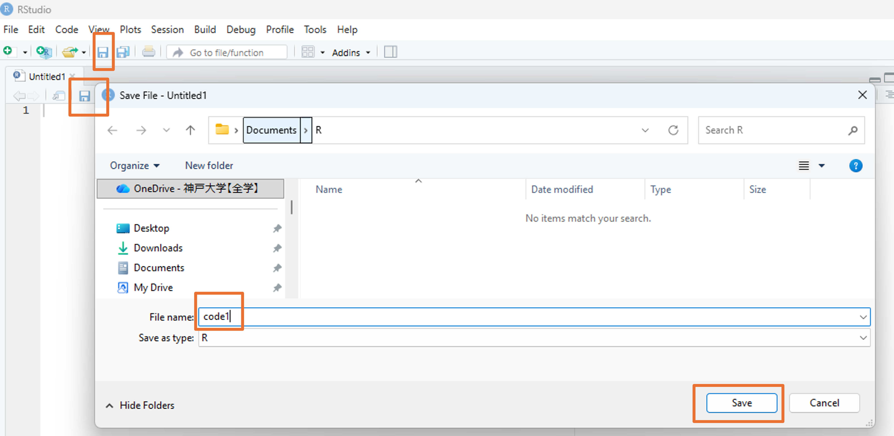

### スクリプトの確認

ファイルが正常に保存されると、右下の `Workign directory` ペインに表示されます。


また、`R`フォルダの中でもファイルを確認できます。


### 次回からは、ファイルをダブルクリックしますことで開けます。

### RStudioを終了した後

注意：RStudioを終了しますと、自動的にヒストリーファイルが作成されます。
ここには入力したコードの履歴が保存されますが、そのまま放置しておいて問題ありません。


## スクリプトの実行

計算を実行してみる。
```{r}
23+45
2*3
12/3
2^3

# オブジェクト a に値を代入し、a を使って計算を行う
# オブジェクトは Environment に保存される
a <- 10
a + 1
```

スクリプトにコードを入力し、その行にカーソルを置いて実行（Run）をクリックすると、結果が出力されます。
もう１つの方法は、`Ctrl-Enter`（Macの場合は`Command-Enter`）を同時に押す方法です。
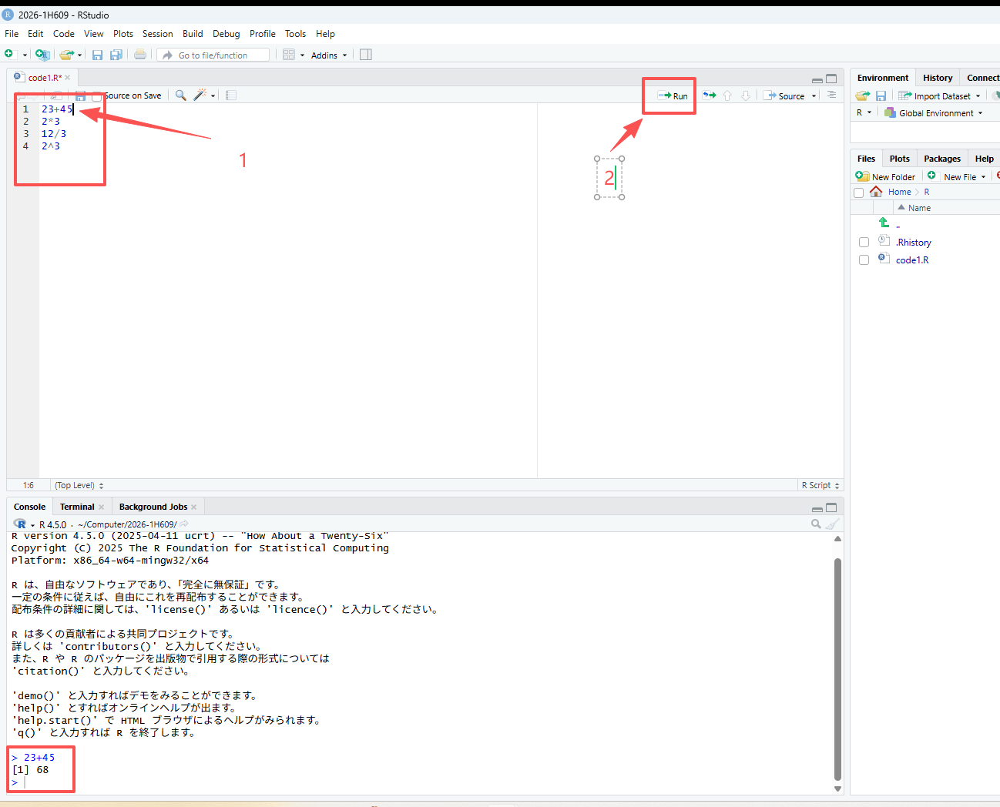

複数行を実行したい場合、領域を指定して（`Ctrl-A`）、（Run）をクリックしますか、`Ctrl-Enter`で実行します。
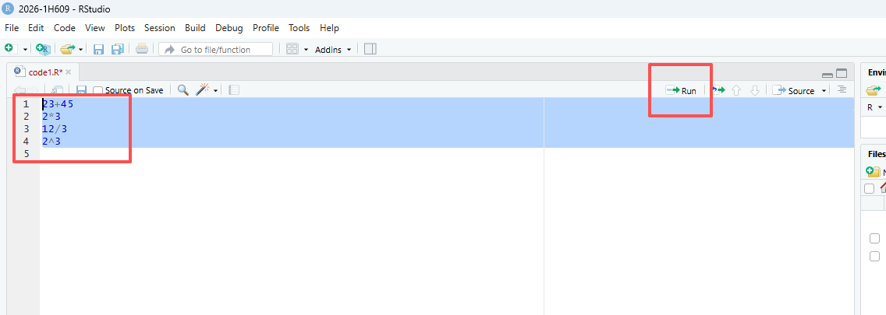

## データ型（Data Types）

- Numeric（数値型）: Integer（整数） と Double（実数）
- Character（文字型）: `"Hello", "Data Science", "2026"`
- Logical（論理型）: `TRUE` または `FALSE`

### データ型の確認

数値型

```{r}
a <- 10
mode(a)
typeof(a)
str(a)
```

文字型

```{r}
b <- "word"
mode(b)
typeof(b)
str(b)
```

## 主なデータ構造

### ベクトル (Vector)

同じデータ型の値を一列に並べた、最も基本的な構造です。

特徴: すべての要素が同じ型（すべて数値、またはすべて文字など）であります必要があります。

値は、 `c()`関数 ( cは要素を結合しますためのc関数)を使用してベクトルに割り当てられます。丸括弧を開閉し、異なる要素をカンマで区切って配置します。

```{r}
vector1 <- c(329, 45, 12, 28)

# 空のベクトルは次のように作成できます。
vecempty <- vector()

# 長さ5の空の数値ベクトル
vecnumempty <- vector(mode="numeric", length=5)

# 長さ8の空の数値ベクトル
veccharempty <- vector(mode="character", length=8)

# 連続する数字のシーケンスを作成します。

vecnum <- 10:16
# 以下の略
vecnum <- c(10, 11, 12, 13, 14, 15, 16)
# 注意：両端（10と16）を含む
```

#### ベクトルには名前を付ける


```{r}
# 数値ベクトルを作成する
vector1 <- c(329, 45, 12, 28)
# ベクトルには名前を付ける
names(vector1) <- c("apple", "orange", "バナナ", "レモン")


# 既に格納されているオブジェクトを使用する
mynames <- c("apple", "orange", "バナナ", "レモン")
names(vector1) <- mynames

# ベクトルの長さ（要素数）を取得する
length(vector1)
```


#### ベクトルから要素を抽出する

```{r}
vector1[1]
vector1[c(1,3)]
vector1[2:4]
vector1["apple"]
vector1[c("apple", "レモン")]  
```


```{r}
# ベクトルの要素を再割り当てする
vector1[2] <- 31
vector1["orange"] <- 31 

# ベクトルの要素を削除する
vector1[-3]

# ベクトルの結合
v1 <- 2:5
v2 <- 4:6
v3 <- c(v1, v2)

# ベクトルの末尾に要素を追加することもできます
v3 <- c(v3, 19)
```


論理演算子

| 演算子 | 意味 
| :--- | :--- | 
| `<` | 未満 |
| `<=` | 以下 | 
| `>` | より大きい |
| `>=` | 以上 | 
| `==` | 等しい（ちょうど） | 
| `!=` | 等しくない | 
| `!` | 〜ではない（否定） | 
| `x \| y` | x または y | 
| `x & y` | x かつ y | 


#### 数値ベクトルの操作

```{r}
# 要素aのうち、2に等しい要素はどれですか？
a <- 1:5
a == 2

# aのどの要素が2よりも優れていますか？
a <- 1:5
a > 2

# 条件を満たすベクトルの要素を抽出する。
a >= 2

# 条件を満たす（TRUEの値となる）実際のサブベクトルを抽出する
a[a >= 2]

# 条件を満たす要素がいくつあるかを数える
length(a[a >= 2])

# ベクトルに2を加えると、ベクトルの各要素に2が加算されます。
a <- 1:5
a + 2

# 同じ長さのベクトル同士を掛け合わせる
a <- c(2, 4, 6)
b <- c(2, 3, 0)
a * b

# ベクトルを別の短いベクトルで乗算する
a <- c(2, 4, 6)
b <- c(2, 3, 0)
a * b
```

要約統計量 関数一覧

| 関数 | 説明 | 備考 |
| :--- | :--- | :--- |
| `mean(x)` | **平均値** (Mean) | 全要素の合計を要素数で割った値 |
| `median(x)` | **中央値** (Median) | データを大きさ順に並べた時、中央にくる値 |
| `min(x)` | **最小値** (Minimum) | ベクトル内の最も小さい値 |
| `max(x)` | **最大値** (Maximum) | ベクトル内の最も大きい値 |
| `var(x)` | **分散** (Variance) | データの散らばり具合を表す指標 |
| `summary(x)` | **要約統計量** (Summary) | 最小、最大、平均、中央値、四分位数を一括表示 |

```{r}
k <- c(1, 3, 12, 45, 3, 2)
summary(k)
```

#### ベクトルの比較

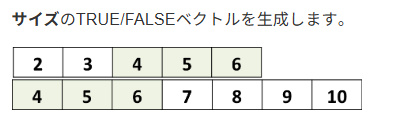
```{r}
# aに含まれる要素のうち、 bにも含まれるものはどれですか？
a <- 2:6
b <- 4:10
a %in% b

# aの要素のうち、 bに含まれる実際の要素を取得します。
a <- 2:6
b <- 4:10
a[a %in% b]

# 2つのベクトルの交点を取得します。
intersect(a, b)

# 2つのベクトルが完全に同一かどうかを確認します
identical(a, b)


# 文字ベクトルは、数値ベクトルと同様に操作されます。
k <- c("mRNA", "miRNA", "snoRNA", "RNA", "lincRNA")
p <- c("mRNA","lincRNA", "tRNA", "miRNA")
k %in% p
k[k %in% p]

# ベクトルmからexonではない要素を選択する
m <- c("exon", "intron", "exon")
m != "exon"
m[m != "exon"]
```

### 因子（Factor）

因子とは、他のベクトルの構成要素を離散的に分類（グループ化）するために使用されるベクトルオブジェクト（1次元）です。

因子は主に統計モデリングに用いられますが、グラフ作成にも役立ちます。

ファクター関数を使用すると、次のようなファクターを作成できます。

```{r}
e <- factor(c("high", "low", "medium", "low"))
str(e)


# 文字ベクトルと因子の例
# 要因ベクトル
e <- factor(c("high", "low", "medium", "low"))
# 文字ベクトル
e2 <- c("high", "low", "medium", "low")
# ベクトルの構造を確認する
str(e)
str(e2)
```

因子内のグループはレベルと呼ばれます。レベルは順序付けできます。
その後、数値ベクトルに適用されるいくつかの演算を使用できます。

```{r}
# 順序付けないベクトル:
e <- factor(c("high", "low", "medium", "low"))
# max(e) # error

# 順序付けたベクトル:
e_ord <- factor(e, levels=c("low", "medium", "high"), ordered=TRUE)
max(e_ord) # "high"がでる
```

### 行列 (Matrix)

ベクトルに「行」と「列」の概念を加えた、2次元の構造です。

特徴: ベクトルと同様、すべての要素が同じデータ型であります必要があります。

#### マトリックスの作成


```{r}
# rbind関数を使用してベクトルから作成します。
x <- c(1, 44)
y <- c(0, 12)
z <- c(34, 4)
b <- rbind(x, y, z)

# cbind関数を使用したベクトルから：
i <- c(1, 0, 34)
j <- c(44, 12, 4)
k <- cbind(i, j)


# 行列関数をゼロから使う：
# nrow: number of rows
# ncol: number of columns
pp <- matrix(c(1, 0, 34, 44, 12, 4), 
    nrow=3,
    ncol=2)
```

#### 二次元物体

ベクトルは要素ごとに1つのインデックスを持ちます（1次元）。
行列は要素ごとに2つのインデックスを持ちます（2次元）。これは、要素の位置（行番号と列番号）に対応します。

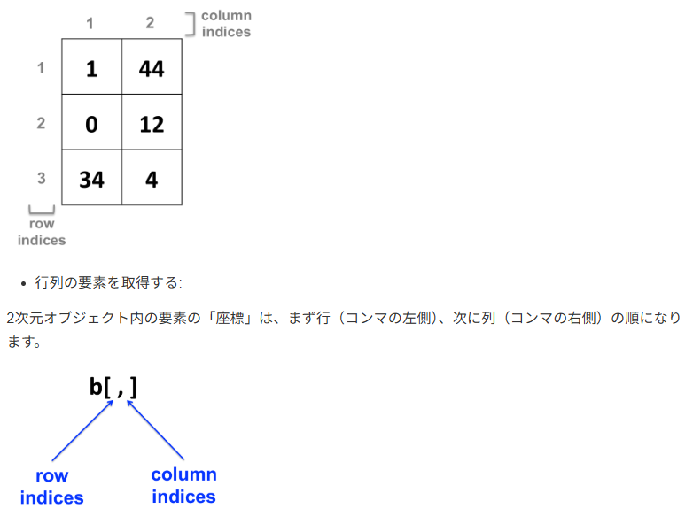

```{r}
x <- c(1, 44)
y <- c(0, 12)
z <- c(34, 4)
b <- rbind(x, y, z)

# 行列のすべての要素に1を加える
b <- b + 1

# 行列のすべての要素に3を掛ける
b <- b * 3

# 行列の最初の行の各要素から2を引きます。
b[1, ] <- b[1, ] - 2

# 条件を満たす要素を置換します。
b[ b > 3 ] <- NA
```


### データフレーム (Data Frame)

実務で最も多用される構造です。表形式のデータ（Excelのようなイメージ）を扱います。行列よりも汎用的です。

特徴: 列ごとに異なるデータ型を持つことができます（例：1列目は名前（文字）、2列目は年齢（数値））。同じ長さでなければなりません。

データフレームは列ごとに構成されます。列は変数であり、行は各変数の観測値です。

#### データフレームを作成する

`data.frame` 関数を使用する場合
```{r}

d <- data.frame(c("Maria", "Juan", "Alba"), 
    c(23, 25, 31),
    c(TRUE, TRUE, FALSE))

# stringsAsFactors: 文字をFactorとしてではなく、文字型として扱うことを保証します
d <- data.frame(c("Maria", "Juan", "Alba"), 
    c(23, 25, 31),
    c(TRUE, TRUE, FALSE),
    stringsAsFactors = FALSE)

# 「stringsAsFactors = FALSE」が役立つ理由の例
# Create a data frame with default parameters
df <- data.frame(label=rep("test",5), column2=1:5)
# Replace one value
# df[2,1] <- "yes"
# Throws an error and doesn't replace the value !

# Create a data frame with:
df2 <- data.frame(label=rep("test",5), column2=1:5, stringsAsFactors = FALSE)
# Replace one value
df2[2,1] <- "yes"
# Works!

```

行列をデータフレームに変換する：

```{r}
# create a matrix
b <- matrix(c(1, 0, 34, 44, 12, 4), 
        nrow=3,
        ncol=2)
# convert as data frame
b_df <- as.data.frame(b)

# 行列操作と非常によく似ています。各要素は行と列のインデックスによって見つけられます。
b_df[1,2]
```


### リスト (List)

異なる型や、異なる構造のオブジェクトをひとまとめにできる「詰め合わせセット」です。

特徴: 数値、文字、ベクトル、さらには別のリストまで、何でも入れることができます。

異なるデータ型を混在できる: 
数値、文字、論理値、さらにはベクトルやデータフレーム、別のリストさえも一つのリストの中に格納できます。

要素ごとに長さが違っても良い: 
「3つの数値」と「10個の文字列」を一つのリストに共存させることができます。

階層構造を持てる: 
リストの中にリストを入れる（入れ子構造）ができるため、複雑なデータ構造を表現するのに適しています。


#### リストの作成

list() 関数を使います。各要素に名前（タグ）を付けるのが一般的です。

```{r}
my_list <- list(
  id = 1,                      # 数値
  name = "Tanaka",             # 文字
  scores = c(80, 90, 75),      # ベクトル
  active = TRUE                # 論理値
)
```

#### 要素へのアクセス方法

```{r}
my_list$name
my_list[[3]]
```
注意点: `my_list[3]`（一重の括弧）を使うと、「3番目の要素を含んだ小さなリスト」が返ってきます。


### 配列 (Array)

行列をさらに多次元（3次元以上）に拡張したものです。

特徴: すべて同じデータ型であります必要があります。立方体のようなデータの重なりをイメージしてください。

多次元構造: 
「縦 × 横」の平面だけでなく、「奥行き」を持たせたデータの塊（立方体のようなイメージ）を作ることができます。

単一のデータ型: 
ベクトルや行列と同様に、格納できるのはすべて同じデータ型（すべて数値、またはすべて文字など）である必要があります。

添字（インデックス）でアクセス: 
3次元のアレイであれば、[行, 列, 次元] のように3つの数字を使ってデータを取り出します。

#### アレイの作成

`array()` 関数を使います。データ本体と、各次元の大きさを指定する `dim` 引数が必要です

```{r}
# 1から12までの数字を使って、2行 × 3列 × 2層 の3次元アレイを作成
my_array <- array(1:12, dim = c(2, 3, 2))
```

#### 要素へのアクセス方法
```{r}
my_array[1, 2, 1]
my_array[, , 2]
```

### データ構造のイメージ

| 次元 | 名称 | 特徴 | イメージ |
| :--- | :--- | :--- | :--- |
| **1次元** | **ベクトル (Vector)** | 同じ型のデータの列 | 線 |
| **2次元** | **行列 (Matrix), データフレーム (Data Frame)**  | 行(Row)と列(Column)の表 | 面 |
| **3次元以上** | **アレイ (Array)** | 行 × 列 × 層（奥行き） | 立体 |


## 特別な値

- `NULL`: 空の状態
- `NA`: 欠損値
- `NaN`: 非数
- `Inf`/`-Inf`: 無限 / -無限

### NULL: 空のオブジェクト

`NULL` はオブジェクトであり、式や関数が未定義の値を返した場合に返されます。
R言語では、`NULL`（大文字）は予約語であり、データ型が不明なデータをインポートした結果として生成される場合もあります。

```{r}
# データ型: NULL 型
class(NULL) 

# 長さ: 0
length(NULL)

# NULL型を確認
x<- NULL
is.null(x)

my_list <- list(a = 1, b = 2, c = 3)
my_list
my_list$b <- NULL  # bを削除
my_list
```


### NA：（利用不可）Rで認識される要素です。


```{r}
# ベクトル内の欠損値を見つける
x <- c(4, 2, 7, NA)

# NAを見つける
is.na(x)

# NAを削除
na.omit(x)
x[ !is.na(x) ]

# 一部の関数は、デフォルトで、または特定の引数によって、NA（欠損値）を処理できます。
x <- c(4, 2, 7, NA)

# default arguments
mean(x)

# NAを削除して、平均値をとる
mean(x, na.rm=TRUE)

# 行列またはデータフレームでは、NA値を含まない行のみを残します。
mydata <- matrix(c(1:10, NA, 12:2, NA, 15:20, NA), ncol=3)

# NA　を含まない行だけを残す
mydata[complete.cases(mydata), ]
# あるいは
na.omit(mydata)

```

### NaN: 数学的なエラー

```{r}
# 0を0で割る
0 / 0 

# 負の数の対数をとる
log(-10)

# NaN は NA の一種として扱われる
is.na(NaN)  # TRUE
is.nan(NA)  # FALSE (NAは数学的エラーではないため)

```

### Inf: 限界を超えた数値

Inf は非常に大きな数値として扱われるため、計算を継続できるのが特徴です。

```{r}
# ゼロ除算
10 / 0  # Inf

# 無限に何かを足しても無限
Inf + 1e10 # Inf

# 無限で割るとゼロになる
10 / Inf # 0

# Inf かどうかの判定
is.finite(10 / 0) # FALSE

# これらが一つのベクトルに混ざった場合、Rは以下のように判定します。
x <- c(1, NA, NaN, Inf)

is.na(x)       # FALSE  TRUE  TRUE FALSE (NaNはNAとしてもカウントされる)
is.nan(x)      # FALSE FALSE  TRUE FALSE
is.infinite(x) # FALSE FALSE FALSE  TRUE
is.finite(x)   #  TRUE FALSE FALSE FALSE (NAとNaNは「有限ではない」)
```


クイック比較表

| 値 | 意味 | データ型 (typeof) | 長さ (length) | 主な発生理由 | 判定関数 |
| :--- | :--- | :--- | :--- | :--- | :--- |
| **NULL** | 存在しない・空 | NULL | 0 | オブジェクトの未定義、リスト要素の削除 | `is.null()` |
| **NA** | 欠損値 (不明) | logical, integer等 | 1 | アンケートの未回答、データの読み込み漏れ | `is.na()` |
| **NaN** | 非数 (計算不能) | double (numeric) | 1 | 0/0, 負の数の平方根など | `is.nan()` |
| **Inf** | 無限大 | double (numeric) | 1 | 1/0, 指数関数のオーバーフロー | `is.infinite()` |


## データのインポート、保存

Rには、さまざまなファイル形式からデータをインポートするための関数やパッケージが用意されています。ここでは、Rにデータを読み込むための一般的な方法をいくつか紹介します。

**データはMEATからダウンロードできます。**

### インポート

```{r}
# パスを正しく設定する
setwd("~/R")

# CSVファイルをインポート
data <- read.csv("data1.csv")
data

# Excelファイル
# openxlsx というパッケージを依存する
if (!require("openxlsx")) install.packages("openxlsx")　## 初回のみインストールする
library(openxlsx)

# Excelファイルをインポート
data <- read.xlsx("data2.xlsx", sheet = 1)
data
```

### 保存

```{r}
# パスを正しく設定する
setwd("~/R")

# CSVファイルとして保存
data <- data.frame(participant_id = c(1, 2, 3, 4, 5, 6, 7, 8),
                   age = c(18, 19, 18, 22, 18, 19, 19, 18),
                   gender = c("male", "female", "male", "female", "female", "female", "male", "male"),
                   condition = c("high", "high", "low", "high", "low", "low", "low", "high"),
                   variable1 = c(9, 15, 9, 11, 4, 6, 4, 12))
write.csv(data, "data3.csv")

# xlsx ファイルとして保存
# Install and load the openxlsx package
if (!require("openxlsx")) install.packages("openxlsx")　## 初回のみインストールする
# library(openxlsx) 　##初回のみロードする

# Save data as Excel file
write.xlsx(data, "data4.xlsx", sheet = 1)
```

成功すると、正しいディレクトリにファイルが表示されます。

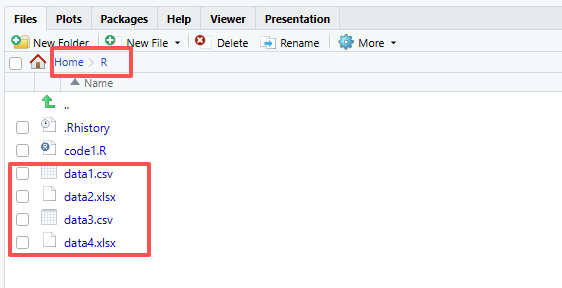

さらに詳しく知りたい場合は、こちらを参照してください：https://bookdown.org/dereksonderegger/444/importing-data.html#google-sheets

## 要約統計量

### 要約統計


要約統計量は、データセットの主な特徴を簡潔にまとめたものです。これには、中心傾向、ばらつき、形状などの指標が含まれます。

この`summary()`関数は、データセット内の各変数に関する重要な統計情報を簡潔に概観します。最小値、第1四分位数、中央値、平均値、第3四分位数、最大値が含まれます。

```{r}
# Create a data set
data <- data.frame(participant_id = c(1, 2, 3, 4, 5, 6, 7, 8),
                   age = c(18, 19, 18, 22, 18, 19, 19, 18),
                   gender = c("male", "female", "male", "female", "female", "female", "male", "male"),
                   condition = c("high", "high", "low", "high", "low", "low", "low", "high"),
                   variable1 = c(9, 15, 9, 11, 4, 6, 4, 12))

# データセットの要約統計量を計算する
summary(data)

# 変数の要約統計量を計算する
summary(data$variable1)
```


#### 参考資料{-}

https://biocorecrg.github.io/CRG_RIntroduction_2021/data-types.html

https://bookdown.org/dereksonderegger/444/importing-data.html#google-sheets

https://bookdown.org/stefanleach/R_basic/importing-saving-and-exploring-data.html#distributions-and-summary-statistics-understanding-basic-properties-of-data