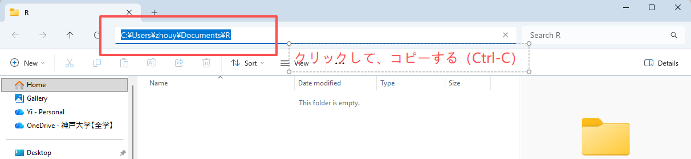
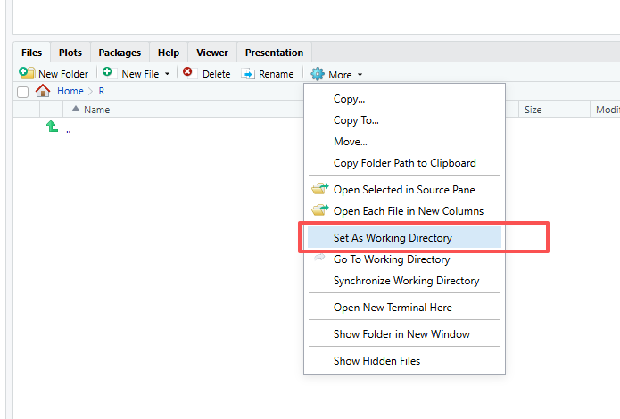
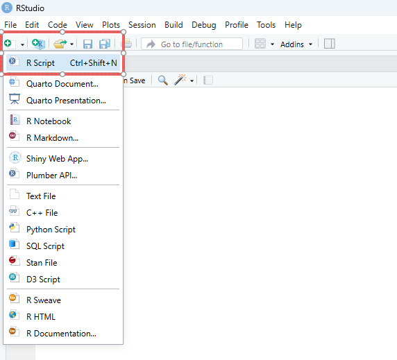
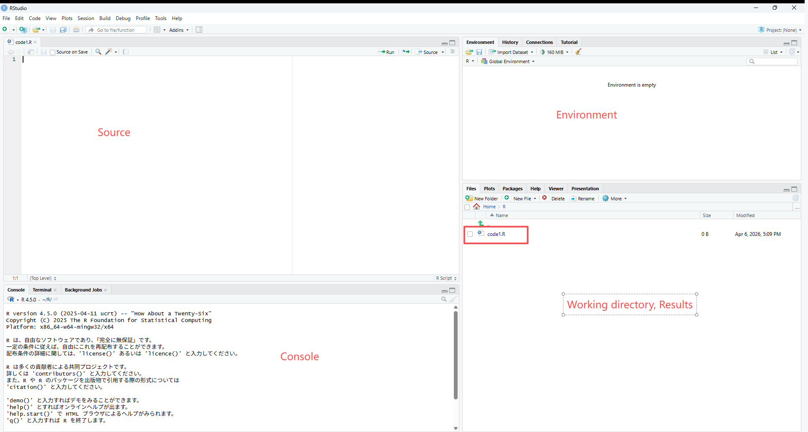
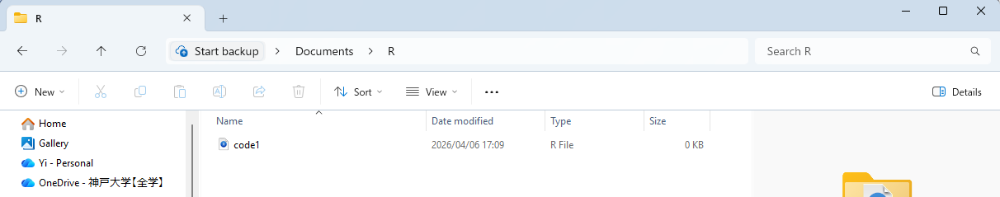
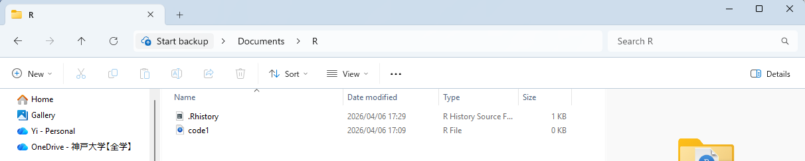

```{r setup, include=FALSE}
knitr::opts_chunk$set(echo = TRUE, fig.width = 5)
```

# RStudioについて

## 準備

### Rコードと関連ファイルを保存するための新しいフォルダを作成する。

例えば、`Document`フォルダ内に`R`という名前のフォルダを作成する。


### RStudioを起動し、作業ディレクトリ（パス、path）をRに設定する。

#### 方法は3通りある。{-}

#### 1. `setwd()`関数を使う
  
1. `R`フォルダに移動する


2. パスを選択し、コピーする。


3. RStudioを開き、コード:`setwd("C:\\Users\\xxx\\Documents\\R")`　あるいは　`setwd("C:/Users/xxx/Documents/R")`
を入力する。

注意：パスを `" "` で囲み、 `\` を `\\` または `/` に書き換えてください。


#### 2. Session をクリックする

1. RStudioの一番上へ移動し、「`Session`」-->「`Set Working Directory`」-->「`Choose Directory`」をクリックする。


2.Rフォルダを選択し、「`Open`」をクリックする。


#### 3. 右下のパネルから設定する

1. RStudioの右下のパネルへ移動する。「`Home`」をクリックし、`R`フォルダを選択する。


2.「`Set Working Directory`」をクリックする。


### 設定の確認

「`Go to Working Directory`」をクリックし、`Files`タブ内に`R`フォルダにいくことを確認してください。


## スクリプトの作成

1. `File` --> `New File` --> `R Script` をクリックする。`Untitled1`というファイルが作成される。


2. あるいは、`File` の下のボタンをクリックし、`R Script` をクリックする。`Untitled1`というファイルが作成される。


### スクリプトの保存

フロッピーディスクのアイコンをクリックする。ファイル名を「code1」と入力し、「`Save`」ボタンをクリックする。


### スクリプトの確認

ファイルが正常に保存されると、右下の `Workign directory` ペインに表示される。


また、`R`フォルダの中でもファイルを確認できる。


### 次回からは、ファイルをダブルクリックすることで開ける

### RStudioを終了した後

注意：RStudioを終了すると、自動的にヒストリーファイルが作成される。ここには入力したコードの履歴が保存されるが、そのまま放置しておいて問題ない。


## スクリプトの実行

