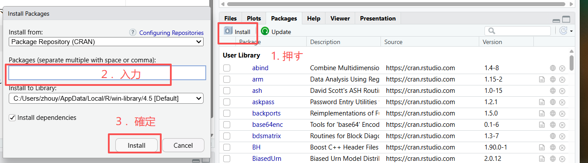
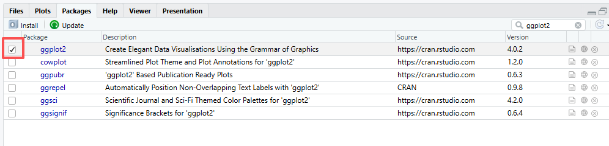
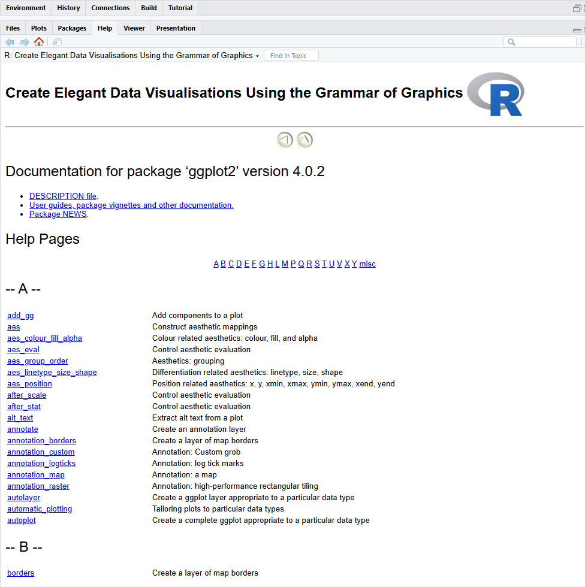
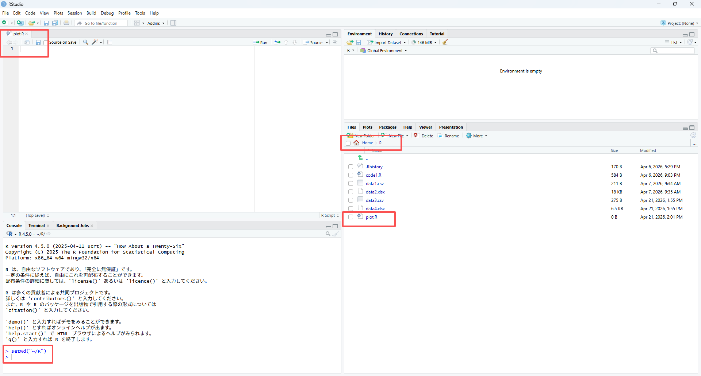
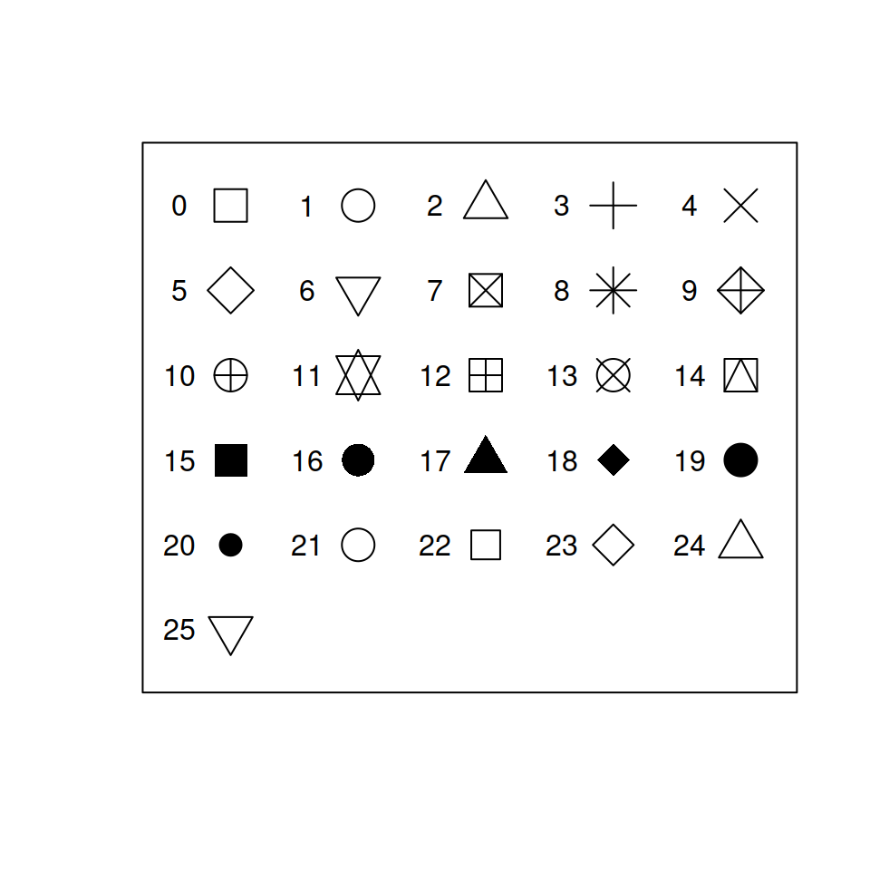

# 第３回（４月２７日）

## パッケージ（package）のインストール

### Rパッケージとは？

Rの本体（Base R）だけでも多くの計算が可能でありますが、パッケージを導入しますことで、データ分析、統計モデリング、グラフ作成などの機能を大幅に拡張できる。

関数の集合体: 誰かが作成した便利な関数、データ、ドキュメントが一つにまとめられている。

CRAN（https://cran.r-project.org/index.html）: 公式のリポジトリ（保存先）には、現在数万件ものパッケージが公開されており、誰でも無料で利用できます。

### パッケージのインストール

方法１．コマンド

RStudioのコンソール（コマンド入力画面）で、以下のコマンドを実行します。

```{r, eval=FALSE}
install.packages("ggplot2") 　## 初回のみインストールする
```

- 注意点: パッケージ名は必ず ダブルクォーテーション "" で囲んでください。

- 実行後: インストールが始まると、進行状況が表示されます。完了するまで数秒〜数十秒待ちましょう。

方法２．手動



### パッケージをロードする

インストールしただけでは、まだその機能は使えません。プログラムの中で使う前に、毎回ロードする必要があります。

方法１．コマンド

RStudioのコンソール（コマンド入力画面）で、以下のコマンドを実行します。

```{r}
library(ggplot2)
```

方法２．手動



パッケージ名の横にあるチェックボックスにチェックが入っている（Checked）状態は、そのパッケージが現在のセッションに正常にロード（読み込み）されていることを意味します。


### パッケージ内の関数を一覧表示する

RStudioの「Packages」タブに表示されているパッケージ名（青色のリンク）をクリックすると、そのパッケージに含まれるすべての関数やデータのヘルプ一覧が表示されます。



## 基本的なグラフの描き方

Rにおいて、最も基本的かつ汎用的なグラフ作成関数は plot() です。これ一つで、データの型に合わせて散布図や折れ線グラフなどを自動的に描き分けてくれます。

### 準備（第２回を参照）

以下の準備を行ってください。

- PCの`Documents`フォルダ内に、作業用として`R`という名前のフォルダを作成します。

- RStudioで作業ディレクトリ（Working Directory）を正しく設定します。

- `plot.R`という名前で新しいRスクリプトを作成し、先ほど作成した`R`フォルダ内に保存します。

- RStudioでそのスクリプトを開きます。


**正しく設定されると、次のような表示になります。**



### データの読み込み

MEATから「data1.csv」をダウンロードして、先ほど作成した`R`フォルダの中に保存します。

```{r}
# パスを正しく設定する
setwd("~/R")

data1 <- read.csv("data1.csv")
data1
```


### 散布図 (Scatter plot)

`data1`の「出生体重（`Birthweight`）」と「収縮期血圧（`SBP`）」の関係を可視化するための散布図を作成します。

```{r}
plot(data1$Birthweight, data1$SBP)
```

引数（オプション）を追加するだけで簡単に変更できます。

```{r}
plot(data1$Birthweight, data1$SBP, 
     pch = 17,              # 点の形状 (17は塗りつぶし三角)
     col = "darkgreen",     # 点の色
     cex = 1.5,             # 点のサイズ (1.5倍)
     xlab = "出生体重 (g)",  # X軸ラベル
     ylab = "収縮期血圧 (mmHg)" # Y軸ラベル
)
```

**1. 点の形状 (Shape / pch)**

Rの標準機能では、`pch`（Plotting Character）という引数に 0から25 の数字を指定することで形状を変えられます。

- 0～14: 枠線のみの記号

- 15～20: 塗りつぶされた記号（よく使われます）

- 21～25: 外枠の色（col）と塗りつぶしの色（bg）を別々に指定できる記号



**2. 点の色 (Color / col)**

色は、名前（文字列）または16進数のカラーコードで指定します。

- 色の名前で指定: `"red"`, `"blue"`, `"darkgreen"`,` "steelblue"` など（Rには657種類の色名が登録されています）。

- カラーコードで指定: `"#FF5733"` のように指定することで、より細かい色調整が可能です。

### 折れ線グラフ (Line plot)

標準の `plot()` 関数で `type = "l"`（Lineの頭文字）を指定します。

```{r}
plot(data1$ID, data1$Birthweight, type = "l")
```

折れ線の色、太さ、ラベル、タイトルの設定、およびX軸の目盛り（ティック）の変更を加えます。

```{r}
# 1. グラフの作成（基本設定とラベル、色、太さ）
plot(data1$ID, data1$Birthweight, 
     type = "l",                    # 折れ線グラフ
     col = "steelblue",             # 線の色
     lwd = 2,                       # 線の太さ
     xlab = "個人ID",               # X軸ラベル
     ylab = "出生体重 (g)",         # Y軸ラベル
     main = "IDごとの出生体重",  # グラフタイトル
     xaxt = "n"                     # デフォルトのX軸目盛りを一旦非表示にする
)

# 2. X軸の目盛りを c(1:10) に設定
axis(side = 1, at = c(1:10))
```


### 棒グラフ (Bar plot)

`barplot()` 関数を使用して、個別のIDごとの出生体重を棒グラフにします。

```{r}
# 棒グラフの作成
barplot(data1$Birthweight)
```

グラフをより「読みやすく（Readable）」するためには、情報の整理、視認性の向上、そして色の使い方がポイントになります。

```{r}

barplot(data1$Birthweight, 
        names.arg = data1$ID,    # X軸のラベルにIDを指定
        col = "skyblue",         # 棒の色
        border = "white",        # 棒の枠線を白にするとスッキリします
        main = "IDごとの出生体重", # タイトル
        xlab = "個人ID",         # X軸ラベル
        ylab = "出生体重 (g)",    # Y軸ラベル
        las = 1,                  # 軸の数値を水平に表示
        ylim = c(0, 150)        # Y軸の範囲を指定して、タイトルとの重なりを防ぐ
)
```


### 円グラフ (Pie plot)

統計学的には、項目が多い場合は棒グラフの方が比較しやすいとされますが、全体における各年代の**シェア（比率）**を一目で見せたい場合には円グラフが有効です。

`pie()` 関数を使用します。まず `table()` 関数で年代ごとの頻度を集計する必要があります。

```{r}
# 年代ごとの人数を集計
age_counts <- table(data1$Age.group)

# 円グラフの作成
pie(age_counts,
    main = "年齢グループ別の割合",
    col = terrain.colors(length(age_counts)), # 自動で色分け
    clockwise = TRUE)                         # 時計回りに配置


# 年代ごとの人数を集計
age_counts <- table(data1$Age)

# 円グラフの作成
pie(age_counts,
    main = "年齢別の割合",
    col = c("skyblue", "orange", "darkgreen", "pink"), # 配色の設定
    clockwise = TRUE)                         # 時計回りに配置
```

ラベルに％を追加する方法: `table()` で集計した度数から`％`を算出し、`paste()` 関数で文字として結合します。

```{r}
# 1. データの集計（例：年代別）
age_counts <- table(data1$Age)

# 2. パーセンテージの計算（小数点第1位まで）
pct <- round(100 * age_counts / sum(age_counts), 1)

# 3. ラベルの作成（「項目名: 00%」という形式）
# 例: "20代: 25.5%"
labels <- paste(names(age_counts), ": ", pct, "%", sep = "")

# 4. 円グラフの描画
pie(age_counts, 
    labels = labels,           # 作成したラベルを指定
    col = c("skyblue", "orange", "darkgreen", "pink"), # 配色の設定
    main = "年代別の構成割合",
    clockwise = TRUE)          # 時計回りに配置
```


統計・Rユーザーに人気のカラーツール: [https://colorbrewer2.org/#type=qualitative&scheme=Set1&n=3](https://colorbrewer2.org/#type=qualitative&scheme=Set1&n=3)


### 箱ひげ図 (Boxplot)

データの分布や外れ値を一目で確認するのに最も適した**箱ひげ図（Boxplot）**を作成します。


```{r}
# 箱ひげ図の作成
boxplot(data1$Birthweight)
```

標準機能でも、引数を追加することでかなり細かく制御できます。

```{r}
# 1. 元のデータから「Birthweight」列のみを取り出し、新しい変数「Birthweight.out」に代入（バックアップ）
Birthweight.out <- data1$Birthweight

# 2. 作成した変数「Birthweight.out」の中身を表示して、現在のデータを確認
Birthweight.out

# 3. 10番目のデータ（要素）を「25」という極端に小さな値に書き換える（外れ値の作成）
Birthweight.out[10] <- 55

# 4. データを確認
Birthweight.out

boxplot(Birthweight.out,
        main = "性別ごとの出生体重分布(外れ値の確認)",
        xlab = "性別",
        ylab = "出生体重 (g)",
        col = "lightblue", # グループごとに色を変える
        border = "darkslategray",     # 枠線の色
        # notch = TRUE,                 # 中央値の信頼区間（くびれ）を表示
        # varwidth = TRUE,              # サンプル数に応じて箱の幅を変える
        las = 1,                      # 軸の数値を水平にする
        outcol = "red",   # 外れ値の「色」を赤にする 
        outpch = 16       # 外れ値の「形」を塗りつぶしの丸にする
)
```


### ヒストグラム (Histogram)

`hist()` 関数を使用します。

```{r}
# 基本的なヒストグラム
hist(data1$Birthweight)
```

標準機能でも、引数を追加することでかなり細かく制御できます。

```{r}
hist(data1$Birthweight,
main = "出生体重の分布（ヒストグラム）",
     xlab = "出生体重 (g)",
     ylab = "頻度",
     col = "skyblue",      # 棒の色
     border = "white"     # 棒の枠線の色
)

```

## 高度的なグラフ：GGPLOT

`ggplot2` は、Rで統計グラフを作成するための最も強力で人気のあるパッケージです。「Grammar of Graphics（グラフの文法）」という設計思想に基づいており、図の要素（データ、軸、色、図形など）を**レイヤー（層）**のように重ねていくことで、複雑なグラフも直感的に作成できます。

**ggplot2 の基本構造**

ggplot2 のコードは、基本的に以下の3つの要素を積み重ねて記述します。

- データ (Data): どのデータフレームを使うか。

- 属性 (Aesthetics - aes): X軸、Y軸、色 (color)、形 (shape) などにどの変数わり当てるか。

- 図形 (Geometries - geom): 散布図 (geom_point)、棒グラフ (geom_bar)、折れ線グラフ (geom_line) など、どの形で描くか。

### 散布図 (Scatter plot)

```{r}
# 1. ggplot2ライブラリを読み込む（未インストールの場合は install.packages("ggplot2") が必要）
library(ggplot2)

# 2. ggplotの基本設定：使用するデータ(data1)と、軸・色の割り当て(aes)を指定
# x軸にID、y軸に出生体重、色と点の形をAge.group(a/b)で分ける設定
ggplot(data1, aes(x = ID, y = Birthweight, color = Age.group, shape = Age.group)) +
  geom_point(size = 4) +  # 散布図の「点」を描画。sizeで点の大きさを調整（4は少し大きめで見やすい）
  scale_color_manual(values = c("a" = "steelblue", "b" = "orange")) + # 色を手動で指定
  labs(title = "年齢グループ別の出生体重散布図", # グラフの各ラベル
       x = "個人ID",
       y = "出生体重 (g)",
       color = "年齢グループ",    # 色の凡例タイトル
       shape = "年齢グループ") +  # 形の凡例タイトル
  theme_minimal() # グラフの背景テーマを「minimal（シンプル）」に設定してスッキリさせる
```

### 折れ線グラフ (Line plot)

```{r}
library(ggplot2)

# IDごとの推移をAge.group(a/b)で色分けして表示
ggplot(data1, aes(x = ID, y = Birthweight, color = Age.group, group = Age.group)) +
  geom_line(size = 1) +                  # 折れ線
  geom_point(size = 2) +                 # データ点
  scale_color_brewer(palette = "Set1") + # 配色設定
  labs(title = "年齢グループ別の出生体重",
       x = "個人ID", y = "出生体重 (g)") +
  theme_bw()                             # 白背景テーマ
```

### 箱ひげ図 (Boxplot)

```{r}
library(ggplot2)

# Age.group(aとb)ごとに出生体重を比較する箱ひげ図
ggplot(data1, aes(x = Age.group, y = Birthweight, fill = Age.group)) +
  geom_boxplot(outlier.color = "red", outlier.shape = 18, outlier.size = 3) + # 箱ひげ図の描画（外れ値を赤色・ひし形で表示）
  geom_jitter(width = 0.1, alpha = 0.5) + # 実際のデータ点（ドット）を重ねて分布をより詳細に見せる
  scale_fill_brewer(palette = "Pastel1") + # 配色設定
  labs(title = "年齢グループ別の出生体重分布", # グラフの各ラベルを日本語に設定
       subtitle = "a群とb群の比較",
       x = "年齢グループ",
       y = "出生体重 (g)",
       fill = "グループ")
```

### ヒストグラム (Histogram)

**1. 色で塗り分ける方法（重ね合わせ）**

2つのグループを同じグラフ内で比較する際に便利です。

```{r}
library(ggplot2)

ggplot(data1, aes(x = Birthweight, fill = Age.group)) +
  # alphaで透明度を調整して、重なり部分を見やすくする
  geom_histogram(position = "identity", alpha = 0.6, bins = 10, color = "white") +
  scale_fill_manual(values = c("a" = "steelblue", "b" = "orange")) +
  labs(title = "年齢グループ別の出生体重分布",
       x = "出生体重 (g)",
       y = "頻度",
       fill = "グループ") +
  theme_minimal()
```

**2. 画面を分割する方法（ファセット）**

グループ数が多い場合や、重なりが複雑で見にくい場合に非常に有効です。臨床データの解析で最も推奨される表示形式の一つです。

```{r}
ggplot(data1, aes(x = Birthweight, fill = Age.group)) +
  geom_histogram(bins = 10, color = "white") +
  # グループごとにグラフを横に並べる
  facet_wrap(~ Age.group) + 
  scale_fill_brewer(palette = "Pastel1") + # 配色設定
  labs(title = "年齢グループ別ヒストグラム（分割表示）", # グラフの各ラベル
       x = "出生体重 (g)",
       y = "頻度") +
  theme_bw() +
  theme(legend.position = "none") # 分割しているので凡例を消すとスッキリします
```

